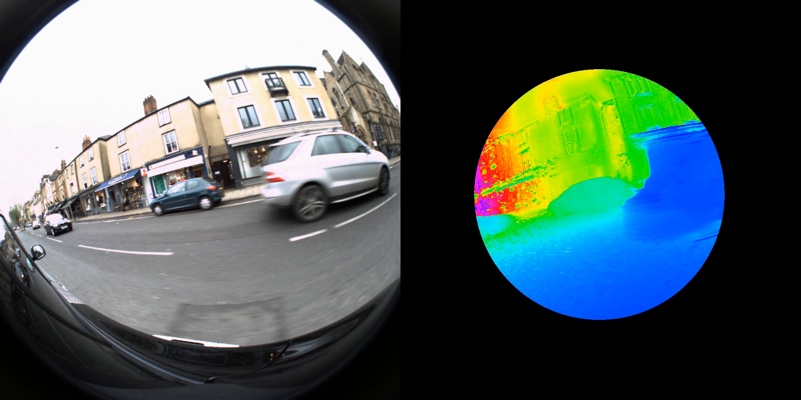

# omnidirectional_SC_Depth_pl
This is experimental version of sc depth pl which support omnidirectional or wide angle fisheye camera.
### click here to watch video(tested on oxford robocar dataset)
[](https://youtu.be/vjYXzsz54C0)

# SC_Depth_pl:

This is a pytorch lightning implementation of **SC-Depth** (V1, V2) for **self-supervised learning of monocular depth from video**.

In the V1 ([IJCV 2021](https://jwbian.net/Papers/SC_Depth_IJCV_21.pdf) & [NeurIPS 2019](https://papers.nips.cc/paper/2019/file/6364d3f0f495b6ab9dcf8d3b5c6e0b01-Paper.pdf)), we propose (i) **geometry consistency loss** for scale-consistent depth prediction over video and (ii) **self-discovered mask** for detecting and removing dynamic regions during training towards higher accuracy. We also validate the predicted depth in the Visual SLAM scenario.

[](https://www.youtube.com/watch?v=OkfK3wmMnpo)

In the V2 ([TPMAI 2022](https://arxiv.org/abs/2006.02708v2)), we propose auto-recitify network (**ARN**) to remove relative image rotation in hand-held camera captured videos, e.g., some indoor datasets. We show that the proposed ARN, which is self-supervised trained in an end-to-end fashion, greatly eases the training and significantly boosts the performance.


## Install
```
conda create -n sc_depth_env python=3.6
conda activate sc_depth_env
conda install pytorch==1.6.0 torchvision==0.7.0 cudatoolkit=10.2 -c pytorch
pip install -r requirements.txt
```

## Dataset

We preprocess all existing video datasets to the following general video format for training and testing:

    Dataset
      -Training
        --Scene0000
          ---*.jpg (list of images)
          ---cam.txt (3x3 intrinsic)
          ---depth (a folder containing gt depths, optional for validation)
        --Scene0001
        ...
        train.txt (containing training scene names)
        val.txt (containing validation scene names)
      -Testing
        --color (containg testing images)
        --depth (containg ground truth depths)
You can convert it by yourself (on your own video data) or download our pre-processed standard datasets:

[**[kitti_raw]**](https://1drv.ms/u/s!AiV6XqkxJHE2mUax6F2N-rjAs43R?e=gwn6Zi) [**[nyu]**](https://1drv.ms/u/s!AiV6XqkxJHE2mUUA5hElvhZXnqOn?e=51SIE1)

## Training

We provide "scripts/run_train.sh", which shows how to train on kitti and nyu.

Then you can start a `tensorboard` session in this folder by
```bash
tensorboard --logdir=ckpts/
```
and visualize the training progress by opening [https://localhost:6006](https://localhost:6006) on your browser. 


## Testing

We provide "scripts/run_test.sh", which shows how test on kitti and nyu.


## Inference

We provide "scripts/run_inference.sh", which shows how to save depths (.npy) and visualization results (.jpg). 

A demo is given here. You can put your images in "demo/input/" folder and run
```bash
python inference.py --config configs/v2/nyu.txt \
--input_dir demo/input/ \
--output_dir demo/output/ \
--ckpt_path ckpts/nyu_scv2/version_10/epoch=101-val_loss=0.1580.ckpt \
--save-vis --save-depth
```
and find the results in "demo/output/" folder.

## Pretrained models

We provide pretrained models on kitti and nyu datasets. You need to uncompress it and put it into "ckpt" folder. If you run the "scripts/run_test.sh" with the pretrained model (fix the path before running), you should get the following results:

[**[kitti_scv1_model]**](https://1drv.ms/u/s!AiV6XqkxJHE2mUNoHDuA2FKjjioD?e=fD8Ish):

|  Models  | Abs Rel | Sq Rel | Log10 | RMSE  | RMSE(log) | Acc.1 | Acc.2 | Acc.3 |
|----------|---------|--------|-------|-------|-----------|-------|-------|-------|
| resnet18 | 0.119   | 0.878  | 0.053 | 4.987 | 0.196     | 0.859 | 0.956 | 0.981 |

 [**[nyu_scv2_model]**](https://1drv.ms/u/s!AiV6XqkxJHE2mUSxFrPz690xaxwH?e=wFOR6A):

|  Models  | Abs Rel | Sq Rel | Log10 | RMSE  | RMSE(log) | Acc.1 | Acc.2 | Acc.3 |
|----------|---------|--------|-------|-------|-----------|-------|-------|-------|
| resnet18 | 0.142   | 0.112  | 0.061 | 0.554 | 0.186     | 0.808 | 0.951 | 0.987 |


## References


#### SC-DepthV1:
**Unsupervised Scale-consistent Depth Learning from Video (IJCV 2021)** \
*Jia-Wang Bian, Huangying Zhan, Naiyan Wang, Zhichao Li, Le Zhang, Chunhua Shen, Ming-Ming Cheng, Ian Reid* 
[**[paper]**](https://jwbian.net/Papers/SC_Depth_IJCV_21.pdf)
```
@article{bian2021ijcv, 
  title={Unsupervised Scale-consistent Depth Learning from Video}, 
  author={Bian, Jia-Wang and Zhan, Huangying and Wang, Naiyan and Li, Zhichao and Zhang, Le and Shen, Chunhua and Cheng, Ming-Ming and Reid, Ian}, 
  journal= {International Journal of Computer Vision (IJCV)}, 
  year={2021} 
}
```
which is an extension of previous conference version:
**Unsupervised Scale-consistent Depth and Ego-motion Learning from Monocular Video (NeurIPS 2019)** \
*Jia-Wang Bian, Zhichao Li, Naiyan Wang, Huangying Zhan, Chunhua Shen, Ming-Ming Cheng, Ian Reid* 
[**[paper]**](https://papers.nips.cc/paper/2019/file/6364d3f0f495b6ab9dcf8d3b5c6e0b01-Paper.pdf)
```
@inproceedings{bian2019neurips,
  title={Unsupervised Scale-consistent Depth and Ego-motion Learning from Monocular Video},
  author={Bian, Jiawang and Li, Zhichao and Wang, Naiyan and Zhan, Huangying and Shen, Chunhua and Cheng, Ming-Ming and Reid, Ian},
  booktitle = {Advances in Neural Information Processing Systems (NeurIPS)},
  year={2019}
}
```

#### SC-DepthV2:
**Auto-Rectify Network for Unsupervised Indoor Depth Estimation (TPAMI 2022)** \
*Jia-Wang Bian, Huangying Zhan, Naiyan Wang, Tat-Jun Chin, Chunhua Shen, Ian Reid*
[**[paper]**](https://arxiv.org/abs/2006.02708v2)
```
@article{bian2021tpami, 
  title={Auto-Rectify Network for Unsupervised Indoor Depth Estimation}, 
  author={Bian, Jia-Wang and Zhan, Huangying and Wang, Naiyan and Chin, Tat-Jin and Shen, Chunhua and Reid, Ian}, 
  journal= {IEEE Transactions on Pattern Analysis and Machine Intelligence (TPAMI)}, 
  year={2021} 
}
```
